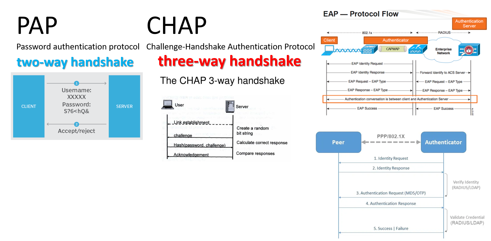

# 111年 第二題組
### 第一題組
- [CVE-2019-0708](https://nvd.nist.gov/vuln/detail/cve-2019-0708)

### 第二題組
- (A) 鯨釣（Whaling）：針對特定人員、公司、組織的發送，目標為釣取特定人員機敏資料或於其電腦植入木馬 ==> 錯!  這是魚叉式釣魚（Spear Phishing
- (B) 魚叉式釣魚（Spear Phishing）：瞄準大型公司、重要人物發送特定釣魚郵件的攻擊 ==> 錯! 這是鯨釣（Whaling）
- (C) 複製型釣魚（Clone Phishing）：攻擊者使用某些方法密切監視受害者收件匣。攻擊者會收受害者近期電子郵件最好有連結或附件並進行複製偽造==> 對!
- (D) 語音釣魚（Voice Phishing）：或稱 vishing會假冒為受害者信任的個人或單位，利用語音通話與各種話術，試圖從受害者取得各種機敏資訊，只限定在電話詐騙，不會使用在電子郵件中 ==> 錯!
  - [什麼是語音釣魚（Vishing）? 該如何防範？](https://blog.trendmicro.com.tw/?p=74434)
  - 語音釣魚（Vishing，結合了網路釣魚和語音）是一種 社交工程（social engineering ） 詐騙，攻擊者會偽裝成他人來打電話給受害者，目的是為了騙取個人資料或金錢。 語音釣魚經常以緊急，甚至帶有脅迫性的電話形式出現 – 像是受害者的帳戶被盜，來電者需要密碼來驗證身份。
### 111-2 第三題 
- (A) 全名為 Command Vulnerabilities and Exposures ==> 錯!
  - CVE =  `Common` Vulnerabilities and Exposures (CVE) 不是`Command` Vulnerabilities and Exposures
- (B) 由 MITRE所屬 National Cybersecurity FFRDC營運維護  ==> 對!
  -  [WIKI](https://en.wikipedia.org/wiki/Common_Vulnerabilities_and_Exposures)
  - The Common Vulnerabilities and Exposures (CVE) system provides a reference method for publicly known information-security vulnerabilities and exposures.
  - The United States' National Cybersecurity FFRDC, operated by The MITRE Corporation, maintains the system, with funding from the US National Cyber Security Division of the US Department of Homeland Security.
  - The system was officially launched for the public in September 1999
- (C) CVE對每一漏洞都有一個專屬編號， CVE為固定的前綴字，YYYY為西元紀年， NNNN為產品公司編號所組成
  -  CVE-2023-23397 ==> CVE為固定的前綴字，YYYY為西元紀年， NNNN為第幾個漏洞編號所組成
- (D) CVE ID由 CVE編號管理機構 CND分配。由資安公司和研究組織組成。 MITRE不可直接發佈 CVE==> 錯!

### 111-2 第四題
- (A) Cobalt Strike原是對手模擬和紅隊行動是安全評估工具，可複製網絡中高級對手的戰術和技術，被勒索集團（ Conti, Hello等）轉換成攻擊威脅橫向移動工具
  - [Cobalt Strike | Adversary Simulation and Red Team Operations](https://www.cobaltstrike.com/)
    - [Why Cobalt Strike?](https://www.cobaltstrike.com/)
      - Cobalt Strike gives you a post-exploitation agent and covert channels to emulate a quiet long-term embedded actor in your customer’s network.
      - Malleable C2 lets you change your network indicators to look like different malware each time.
      - These tools complement Cobalt Strike’s solid social engineering process, its robust collaboration capability, and unique reports designed to aid blue team training. 
- (B) Mimikatz原是進行遠端指令執行使用的好工具，卻被勒索集團(Doppelpaymer, Revil等）用在任意命令執行與橫向移動
  - windows密碼獲取神器 - mimikatz 
- (C) ADFind應用在 AD搜尋的實用工具，被勒索集團(ProLock, Revil等)利用在橫向移動
  - Adfind是一款在域環境下非常強大的資訊搜集工具，允許使用者在域環境下輕鬆搜集各種資訊
  - [Mitre Att@ck|Software|AdFind](https://attack.mitre.org/software/S0552/)
    - AdFind is a free command-line query tool that can be used for gathering information from Active Directory
    - Mitre Att@ck|戰技(Techniques Used)
      - T1087.002_Account Discovery: Domain Account
      - T1482_Domain Trust Discovery 
- (D) MegaSync原是雲端儲存空間，被勒索集團(RansomEXX, LockBit 等)利用公開不付贖金外洩資料的載點
  - [LockBit現為全球最猖獗的勒索軟體，3年來受害組織超過1,600個(2023)](https://www.ithome.com.tw/news/157357)
  - [Lockbit 3.0勒索病毒](https://zhuanlan.zhihu.com/p/539988272)

# 111年 第三題組
- PPP | Point-to-Point Protocol | [對等協定(端點對端點協定)](https://zh.wikipedia.org/wiki/%E7%82%B9%E5%AF%B9%E7%82%B9%E5%8D%8F%E8%AE%AE)
  - 工作在OSI 第二層_資料鏈路層(data link layer)
  - 用在兩節點(two routers)間建立直接的連接，並可以提供連接認證、傳輸加密以及壓縮
  - PPP可以使用不同身分認證機制：PAP和CHAP
  - PPP is a layered protocol that has three components:
    - 1.An encapsulation component that is used to transmit datagrams over the specified physical layer.
    - 2.連線建立與中斷 ==> `鏈路控制協定 A Link Control Protocol (LCP)`to establish, configure, and test the `link鏈路` as well as negotiate settings, options and the use of features.
    - 3.One or more `Network Control Protocols (NCP)|網路控制協定` used to negotiate optional configuration parameters and facilities for the network layer.  
  - PPP 的兩種衍生協定：`以太網點對點協議(PPPoE|RFC 2516|Point-to-Point Protocol over Ethernet)`  和`ATM 點對點協議(PPPoA)|RFC 2364 |Point-to-Point Protocol over ATM (PPPoA) `，ISP 最常使用它們來與客戶建立數字用戶線(DSL) 互聯網服務 LP 連接。

- PAP | Password authentication protocol | [通行碼鑑別協定](https://zh.wikipedia.org/zh-tw/%E5%AF%86%E7%A0%81%E8%AE%A4%E8%AF%81%E5%8D%8F%E8%AE%AE)
  - PAP是一種使用密碼的認證協定, 定義在 [Request for Comments: 1334 PPP Authentication Protocols](https://datatracker.ietf.org/doc/html/rfc1334)
  - PPP使用的 PAP 允許使用者訪問伺服器資源之前使用 PAP 進行驗證。
  - 幾乎所有的網路作業系統遠端伺服器都支援PAP。
  - 缺點==> PAP在網路上傳送未加密的ASCII密碼，因此被認為是不安全的。當遠端伺服器不支援諸如CHAP或EAP（後者實際上是一種框架）這樣的更強的認證協定時，PAP被作為最後的對策來使用。
  - 工作周期(Working cycle) ==>  two-way handshake
    - 1.Client sends username and password.客戶端傳送使用者名稱和密碼 This is sent repeatedly until a response is received from the server.
    - 2.Server sends `authentication-ack` (if credentials are OK) or `authentication-nak` (otherwise)  如果憑據正確，伺服器傳送認證確認（authentication-ack），其他情況則傳送認證否定（authentication-nak）
- CHAP | Challenge-Handshake Authentication Protocol |詢問握手認證協議
  - CHAP|挑戰握手驗證協議|質詢握手認證協議
  - CHAP是一個用來驗證用戶或網絡提供者的協議。負責提供驗證服務的機構，可以是網際網路服務供應商，又或是其他的驗證機構。
  - 工作周期(Working cycle) ==> 通過`三次握手|three-way handshake`周期性的校驗對端的身份，可在初始鏈路建立時完成時，在鏈路建立之後重複進行。
  - RFC 1994詳細定義了CHAP這個協議。
  - CHAP通過`增量改變標識`和`「challenge-value」的值`避免`重放攻擊`。
- EAP | Extensible Authentication Protocol| [可延伸的驗證通訊協定](https://zh.wikipedia.org/zh-tw/%E6%89%A9%E5%B1%95%E8%AE%A4%E8%AF%81%E5%8D%8F%E8%AE%AE)
  - EAP是一個在`無線網路`或`PPP對等協定`中普遍使用的認證框架。它被定義在 RFC 3748 ，取代了舊版協定 RFC 2284，後來被新版協定 RFC 5247 取代。
  - EAP 不僅可以用於無線區域網路，還可以用於有線區域網路
  - 但它在無線區域網路中使用的更頻繁。
  - WPA 和 WPA2 標準已經正式採納了 5 類 EAP 作為正式的認證機制
  - EAP 是一個認證框架，不是一個特殊的認證機制。
  - EAP 方法 ==> EAP 提供一些公共的功能，並且允許協商所希望的認證機制。這些機制被叫做 EAP 方法，現在大約有 40 種不同的方法。
  - IETF 的 RFC 中定義的方法包括：EAP-MD5、EAP-OTP、EAP-GTC、EAP-TLS、EAP-SIM 和 EAP-AKA，還包括一些廠商提供的方法和新的建議。
  - 無線網路中常用的方法包括 EAP-TLS、EAP-SIM、EAP-AKA、PEAP、LEAP 和 EAP-TTLS。
- 更多網路認證協定==>請參讀[Authentication protocol](https://en.wikipedia.org/wiki/Authentication_protocol)

## 其他
- 更多惡意程式 請參閱
  - [微軟官方文件 Understanding malware & other threats](https://learn.microsoft.com/en-us/microsoft-365/security/intelligence/understanding-malware?view=o365-worldwide)
  - [Understanding Malware: 10 Common Types You Should Know About](https://www.makeuseof.com/tag/viruses-spyware-malware-etc-explained-understanding-online-threats/#:~:text=Understanding%20Malware%3A%2010%20Common%20Types%20You%20Should%20Know,7.%20Scareware%20...%208%208.%20Rootkit%20...%20%E6%9B%B4%E5%A4%9A%E9%A0%85%E7%9B%AE)
- [為什麼CVE-2023-23397你必須關注？並且應盡速更新 ](https://www.informationsecurity.com.tw/article/article_detail.aspx?aid=10386)
